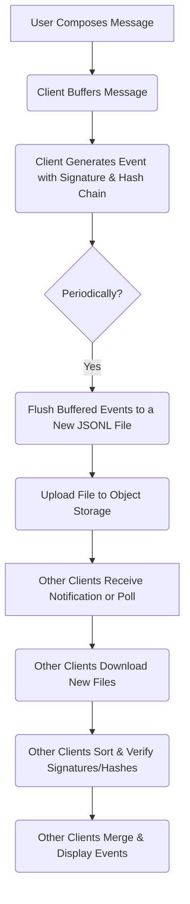

# Bucket Chat Protocol Specification v1.0

1. Overview and Design Principles
The Bucket Chat protocol is a decentralized, serverless chat system that leverages cloud object storage for persistence and security. Its core design principles are simplicity, transparency, replayability, and cloud agnosticism. The protocol eliminates the need for central servers, databases, or daemons; instead, clients directly read and write data to an object store bucket.
A conversation, known as a room, is represented by a bucket or bucket namespace in an object store like S3, GCS, or MinIO. The source of truth for each room is a series of immutable JSON Lines (JSONL) log files. Security is guaranteed through cryptographic signatures and hash chains to prevent forgery and tampering, while immutable storage policies prevent silent overwrites or deletions.

2. Storage Model and File Structure
The protocol defines a specific file structure within each room's bucket to ensure chronological and self-describing logs.
2.1 Bucket Structure
The file path for all chat logs follows a strict convention:
/rooms/{room_id}/
    metadata.json
    logs/
        YYYY-MM-DD/
            messages_{start_ts}_{end_ts}_{client_id}.jsonl

 * metadata.json: This file contains essential room information, such as its ID, name, member list, and description.
 * logs/: This directory stores all chat events, grouped into subdirectories by date.
 * messages_{start_ts}_{end_ts}_{client_id}.jsonl: The immutable log files are named using a timestamp-based convention that encodes their chronological order, making it easy for clients to reconstruct history by listing and sorting files. The naming convention includes the start and end timestamps and the client_id that wrote the file.
2.2 Event Schema
Each line in a JSONL file is a single, self-contained event. The schema for a standard event is as follows:
```
{
  "event_id": "room_abc123::20250914T120045.123Z::uuid4",
  "room_id": "room_abc123",
  "timestamp_ms": 1757841645123,
  "sender_id": "user:alice",
  "type": "m.room.message",
  "parent_event_id": null,
  "prev_event_hash": "sha256(previous_event_json)",
  "signature": "base64_ed25519_signature",
  "content": { "body": "Hello, Bucket Chat!" }
}
```

 * event_id: A unique identifier for the event.
 * room_id: The ID of the room the event belongs to.
 * timestamp_ms: The creation time of the event in milliseconds since the epoch.
 * sender_id: The identifier of the user who created the event.
 * type: The type of event (e.g., m.room.message, m.room.redaction, m.room.member).
 * parent_event_id: Used to link events for message threading.
 * prev_event_hash: A hash of the sender's previous event, creating a hash chain that prevents silent tampering.
 * signature: A cryptographic signature that verifies the sender's authenticity and prevents forgery.
 * content: The event's payload, which varies depending on the type field.
3. Client Implementation Flow
The protocol specifies clear responsibilities for clients to ensure data integrity and synchronization.
3.1 Client Workflow Diagram
This diagram illustrates the flow for a client writing and reading messages.



3.2 Writing Messages
To write messages, a client must:
 * Buffer Events: Events are buffered locally before being written to storage.
 * Generate a File: Periodically, the client flushes the buffered events into a new, immutable JSONL file. This can be done every 5–10 seconds or after a certain number of messages.
 * Upload: The client uploads the new file to the correct daily directory (/logs/YYYY-MM-DD/) within the room's bucket. It's crucial that clients never overwrite existing files.
3.3 Reading Messages and State Resolution
To read messages and reconstruct the chat history, a client must:
 * List and Sort Files: List all files in the relevant /logs/YYYY-MM-DD/ directories and sort them chronologically by their start_ts timestamp in the filename.
 * Merge Events: Merge the records from all files, sorting them by the timestamp_ms field within the event schema to create a single, correct timeline of events.
 * Verify Integrity: For each event, verify the cryptographic signature and the hash chain to detect any tampering. A broken chain indicates a security breach.
 * Resolve State: Process the timeline of events to resolve the current state of the room, including handling redactions, membership changes, and message threading.
4. Cloud Object Store Configuration
To deploy a Bucket Chat room, the following steps must be taken to configure the object store bucket:
 * Create the Bucket: A bucket is created for each room, for example, bucket-chat-room-abc123.
 * Enable Immutability: The most critical step is to enable a write-once, immutable policy on the bucket. This is known as Object Lock in S3/MinIO (using compliance mode) and Bucket Lock in GCS. This policy ensures that once an object is written, it cannot be altered or deleted for a specified retention period.
 * Access Control: Read/write permissions are granted to room participants, but overwrite/delete permissions are explicitly disallowed. The use of short-lived credentials or tokens is recommended for client security.
5. Real-Time Conversation and Synchronization
While the protocol is based on immutable files, new messages can be detected in two ways:
 * Storage Events: Use cloud-native event notifications (e.g., S3 Event Notifications, GCS Pub/Sub) to get immediate updates when a new file is uploaded.
 * Client Polling: Clients can periodically poll the storage bucket to check for new files.
Clients must track the last seen event to only fetch new files and ensure a seamless, synchronized conversation. The chronological, immutable logs allow clients to always reconstruct the full history, providing replayability of all events.
